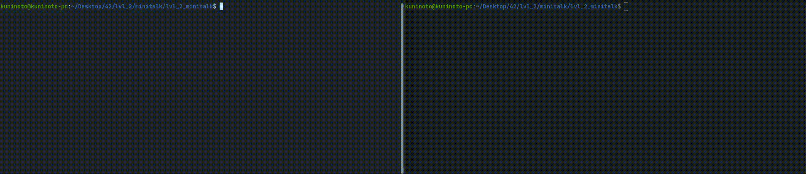

# minitalk (42Porto - 42Cursus)  &nbsp; 

## Grade: 125/100

### Installing and running the project:

1- Clone this repository
	
	git clone https://github.com/Kuninoto/42_minitalk
2- Navigate to _lvl_2_minitalk_ and run `make`
	
	cd 42_minitalk/lvl_2_minitalk
   	make
3- `make clean` so that you don't keep those object files that you won't need anymore

	make clean
4- Run server and copy its PID to the client alongside the message you want to send.

	./server
	./client <server_PID> <message>

###  Subject: [minitalk en_subject](./extras/en.subject_minitalk.pdf)

#### Makefile Available Targets:  
`make` or `make all` - Makes _client_ and _server_  
`make clean` - Deletes all the resulting object files  
`make fclean` - Deletes the executables and all the resulting object files  
`make re` - fclean + all  
`make bonus` - same as `all`, added for subject purposes  

### Useful links:  
- https://www.youtube.com/watch?v=83M5-NPDeWs
- https://www.geeksforgeeks.org/bitwise-operators-in-c-cpp/
- https://emojidb.org/terminal-emojis

## Disclaimer
> At [42School](https://en.wikipedia.org/wiki/42_(school)), almost every project must be written in accordance to the [Norm](./extras/en_norm.pdf), the schools' coding standard. As a result, the implementation of certain parts may appear strange and for sure had room for improvement.

---
Made by Nuno Carvalho (Kuninoto) | nnuno-ca@student.42porto.com  

 <a href="https://www.linkedin.com/in/nuno-carvalho-218822247"/> &nbsp;
