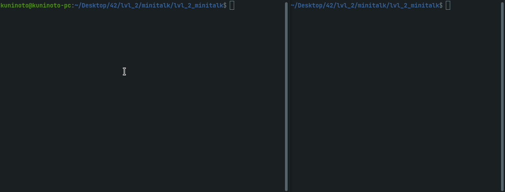

# minitalk (42Porto - 42Cursus)  

## Grade: 125/100  

### Showcase

### Description
2 programs, `server` and `client` that use the UNIX signals SIGUSR1 and SIGUSR2 to exchange binary-encoded messsages - Introduction to Inter Process Communication (IPC).  

### Installing and running the project

1- Clone this repository
	
	git clone https://github.com/Kuninoto/42_minitalk
2- Run `make`
	
   	make
3- `make clean` so that you don't keep those object files that you won't need anymore

	make clean
4- Run `server`, copy its PID and run `client` with it alongside the message you wish to send.

	./server
	./client <server_PID> <message>

#### Makefile available targets  
`make` or `make all` - Makes `server` and `client`  
`make clean` - Deletes all the resulting object files  
`make fclean` - Deletes the executables and all the resulting object files  
`make re` - `fclean` + `all`  
`make bonus` - same as `all`, added for assignment purposes  

### Useful links:  
[Sending and Handling Signals in C (kill, signal, sigaction)](https://www.youtube.com/watch?v=83M5-NPDeWs)  
[Bitwise operators in C](https://www.geeksforgeeks.org/bitwise-operators-in-c-cpp/)  

## Disclaimer
> At [42School](https://en.wikipedia.org/wiki/42_(school)), almost every project must be written in accordance to the "Norm", the schools' coding standard. As a result, the implementation of certain parts may appear strange and for sure had room for improvement.

---
Made by Nuno Carvalho (Kuninoto) | nnuno-ca@student.42porto.com  

 <a href="https://www.linkedin.com/in/nuno-carvalho-218822247"/> &nbsp;
